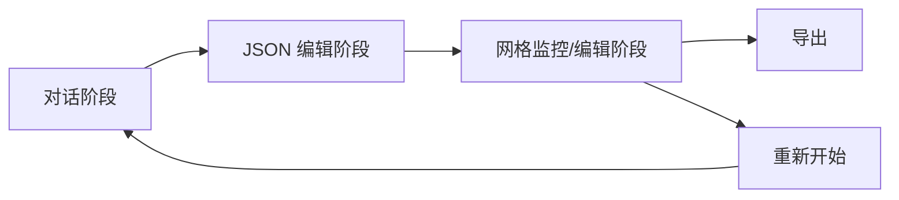

# 幻灯片监控与编辑界面设计方案

## 概述

设计一个全新的全屏网格视图界面，用于监控 Designer Agent 的并发生成进度，以及支持用户对单个幻灯片进行预览和修改。

## 设计决策总结

| 决策项 | 选择 |
|--------|------|
| 整体布局 | 全屏网格视图（类似看板） |
| 卡片交互 | 原地展开（手风琴效果） |
| 展开内容 | 左右分栏：预览 + 编辑区 |
| 页面组织 | 分阶段单向流程 |
| 进度刷新 | 自动定时刷新（2-3秒） |

---

## 用户流程



### 阶段说明

1. **对话阶段** (`collecting` / `architect`)
   - 保持现有聊天界面
   - 用户与 Agent 对话收集信息
   - Architect 生成演示文稿规划

2. **JSON 编辑阶段** (`editing_plan`)
   - 显示 JSON 编辑器
   - 用户检查/修改演示文稿规划
   - 确认后进入生成阶段

3. **网格监控/编辑阶段** (`designing` / `completed`)
   - 全屏网格视图
   - 实时监控生成进度
   - 点击卡片展开编辑

---

## 网格视图设计

### 整体布局

```
┌─────────────────────────────────────────────────────────────────┐
│  📊 幻灯片生成监控                    [3/10 完成] [■■■░░░░░░░]  │
├─────────────────────────────────────────────────────────────────┤
│                                                                 │
│  ┌─────────┐  ┌─────────┐  ┌─────────┐  ┌─────────┐            │
│  │ Slide 1 │  │ Slide 2 │  │ Slide 3 │  │ Slide 4 │            │
│  │  ✅     │  │  ✅     │  │  🔄     │  │  ⏳     │            │
│  │ [缩略图]│  │ [缩略图]│  │ [加载中]│  │ [等待中]│            │
│  │ 标题页  │  │ 目录    │  │ 数据概览│  │ 趋势分析│            │
│  └─────────┘  └─────────┘  └─────────┘  └─────────┘            │
│                                                                 │
│  ┌─────────┐  ┌─────────┐  ┌─────────┐  ┌─────────┐            │
│  │ Slide 5 │  │ Slide 6 │  │ Slide 7 │  │ Slide 8 │            │
│  │  ⏳     │  │  ⏳     │  │  ⏳     │  │  ⏳     │            │
│  └─────────┘  └─────────┘  └─────────┘  └─────────┘            │
│                                                                 │
├─────────────────────────────────────────────────────────────────┤
│  [📦 导出为单文件]                          [🔄 重新开始]       │
└─────────────────────────────────────────────────────────────────┘
```

### 卡片状态

| 状态 | 图标 | 背景色 | 说明 |
|------|------|--------|------|
| pending | ⏳ | 灰色 | 等待生成 |
| generating | 🔄 | 蓝色脉冲 | 正在生成 |
| completed | ✅ | 绿色 | 生成成功 |
| failed | ❌ | 红色 | 生成失败 |
| modified | ✏️ | 橙色 | 用户已修改 |

### 卡片内容

每个卡片包含：
- **状态图标**：右上角显示
- **缩略图区域**：
  - pending/generating：显示占位符或加载动画
  - completed：显示 iframe 渲染的缩略预览
  - failed：显示错误提示
- **标题**：slide 的 title
- **类型标签**：如 `title`, `bullet_list`, `chart`

---

## 展开视图设计

点击卡片后，该卡片原地展开，其他卡片收缩到最小或隐藏。

### 展开布局

```
┌─────────────────────────────────────────────────────────────────┐
│  ← 返回网格视图                              Slide 3 / 10      │
├─────────────────────────────────────────────────────────────────┤
│                                                                 │
│  ┌───────────────────────────┐  ┌─────────────────────────────┐│
│  │                           │  │  📝 修改此幻灯片            ││
│  │                           │  ├─────────────────────────────┤│
│  │                           │  │  ┌─────────────────────────┐││
│  │      [iframe 预览]        │  │  │ 请描述您想要的修改...   │││
│  │                           │  │  └─────────────────────────┘││
│  │                           │  │  [🔄 应用修改]              ││
│  │                           │  ├─────────────────────────────┤│
│  │                           │  │  📋 JSON 配置               ││
│  │                           │  │  ┌─────────────────────────┐││
│  │                           │  │  │ {                       │││
│  │                           │  │  │   "id": "slide_3",     │││
│  │                           │  │  │   "type": "chart",     │││
│  │                           │  │  │   ...                   │││
│  │                           │  │  └─────────────────────────┘││
│  │                           │  │  [💾 保存 JSON]             ││
│  │                           │  ├─────────────────────────────┤│
│  │                           │  │  [🔁 重新生成整个幻灯片]    ││
│  └───────────────────────────┘  └─────────────────────────────┘│
│                                                                 │
├─────────────────────────────────────────────────────────────────┤
│  [← 上一页]                                        [下一页 →]   │
└─────────────────────────────────────────────────────────────────┘
```

### 右侧编辑区功能

1. **修改请求输入框**
   - 文本输入区域
   - 用户描述想要的修改
   - 点击"应用修改"调用 Designer Agent 进行修改

2. **JSON 编辑器**
   - 显示当前 slide 的 JSON 配置
   - 可折叠的 expander
   - 用户可直接编辑 JSON
   - 保存后重新生成

3. **重新生成按钮**
   - 使用原始配置重新生成整个 slide

---

## 自动刷新机制

### 刷新策略

```python
# 伪代码
if current_phase == "designing":
    if has_pending_or_generating_slides():
        # 每 2 秒刷新一次
        time.sleep(2)
        st.rerun()
    else:
        # 全部完成，停止自动刷新
        current_phase = "completed"
```

### 刷新触发条件

- 当前阶段为 `designing`
- 存在 `pending` 或 `generating` 状态的 slide
- 非展开状态（展开编辑时暂停自动刷新）

---

## Session State 新增变量

```python
# 网格视图相关
st.session_state.grid_view_expanded_slide = None  # 当前展开的 slide id
st.session_state.last_refresh_time = None         # 上次刷新时间
st.session_state.auto_refresh_enabled = True      # 是否启用自动刷新

# 阶段状态
# current_phase 可能的值：
# - "collecting": 收集信息阶段
# - "architect": Architect 规划阶段  
# - "editing_plan": JSON 编辑阶段
# - "designing": Designer 生成阶段
# - "completed": 全部完成
```

---

## 实现任务分解

### Phase 1: 基础网格视图
- [ ] 创建 `render_grid_view()` 函数
- [ ] 实现卡片渲染逻辑
- [ ] 从 manifest.json 读取状态
- [ ] 显示进度统计

### Phase 2: 自动刷新
- [ ] 实现定时刷新逻辑
- [ ] 添加刷新状态检测
- [ ] 生成完成后停止刷新

### Phase 3: 卡片展开
- [ ] 实现展开/收起逻辑
- [ ] 展开视图的预览 iframe
- [ ] 编辑区域 UI

### Phase 4: 编辑功能
- [ ] 修改请求输入和处理
- [ ] JSON 编辑和保存
- [ ] 重新生成单个 slide

### Phase 5: 页面导航
- [ ] 修改 main() 函数路由逻辑
- [ ] 根据 current_phase 渲染不同界面
- [ ] 添加返回/重新开始按钮

---

## 技术注意事项

### Streamlit 限制

1. **自动刷新**：使用 `time.sleep()` + `st.rerun()` 实现，可能导致轻微闪烁
2. **动画效果**：Streamlit 原生不支持平滑动画，展开/收起为即时切换
3. **iframe 渲染**：使用 `st.components.v1.html()` 或 `st.components.v1.iframe()`

### 并发安全

- manifest.json 作为状态源
- slide_generator 在后台线程/进程运行
- 前端只读取状态，不直接修改生成进程

---

## 下一步

1. 确认此设计方案
2. 切换到 Code 模式开始实现
3. 按 Phase 逐步开发和测试