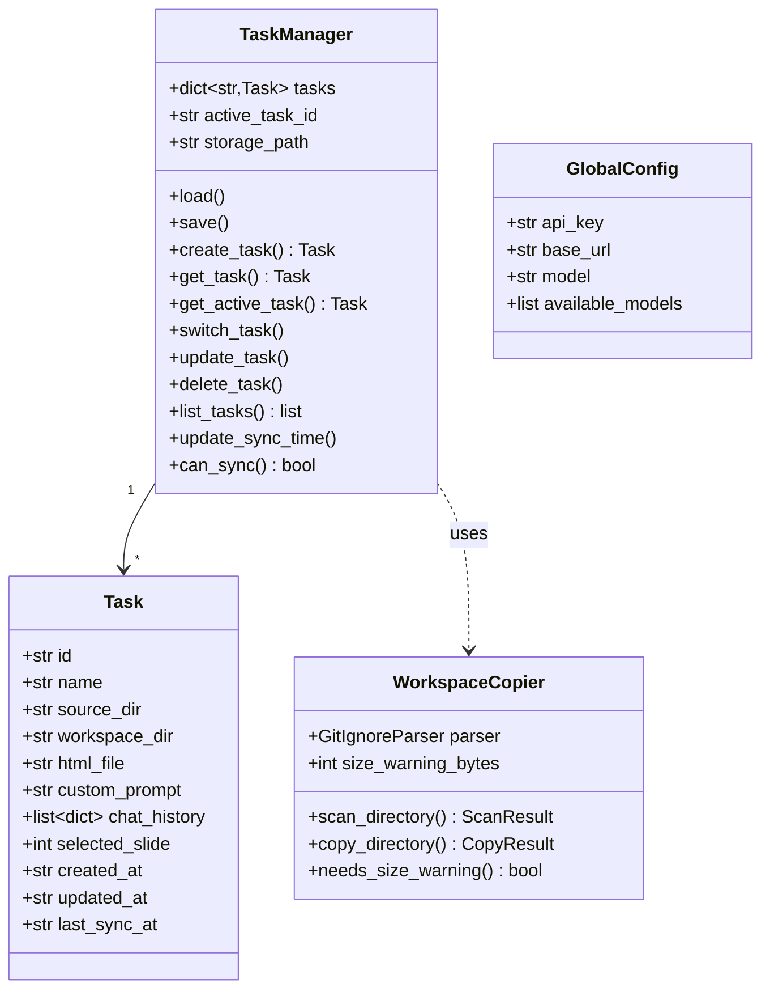
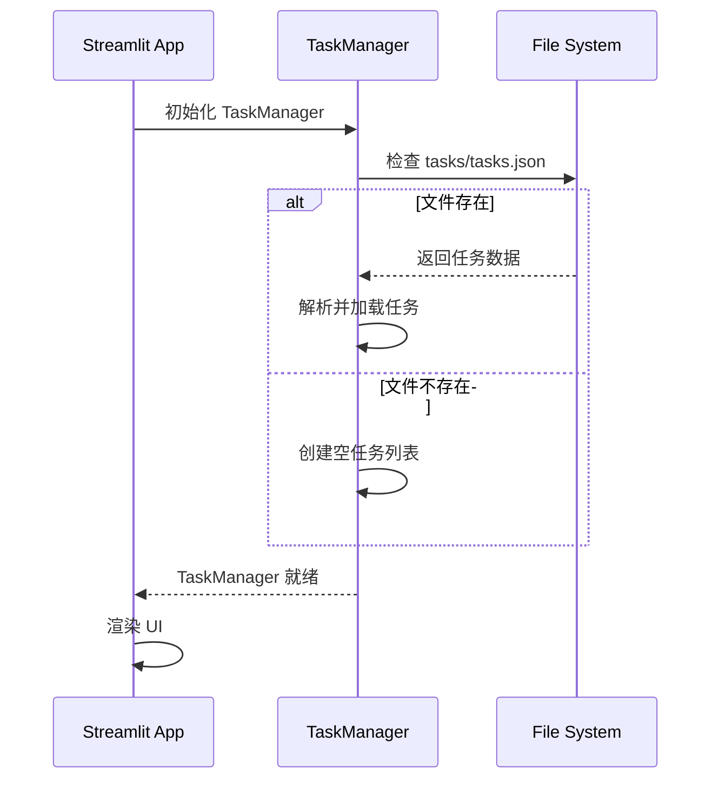
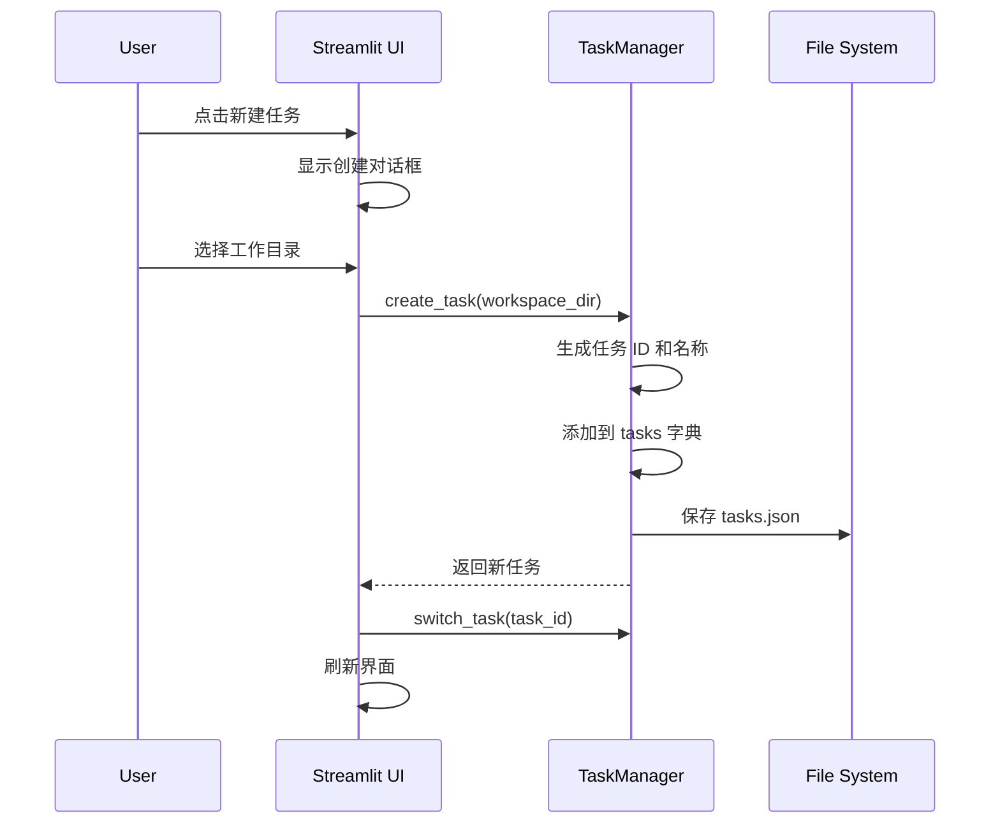
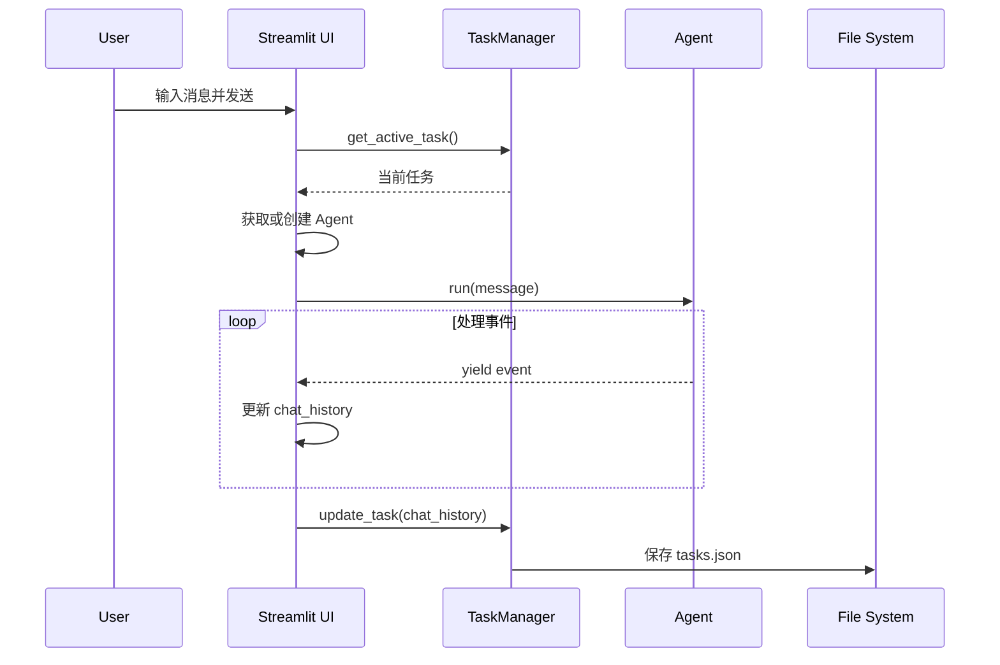
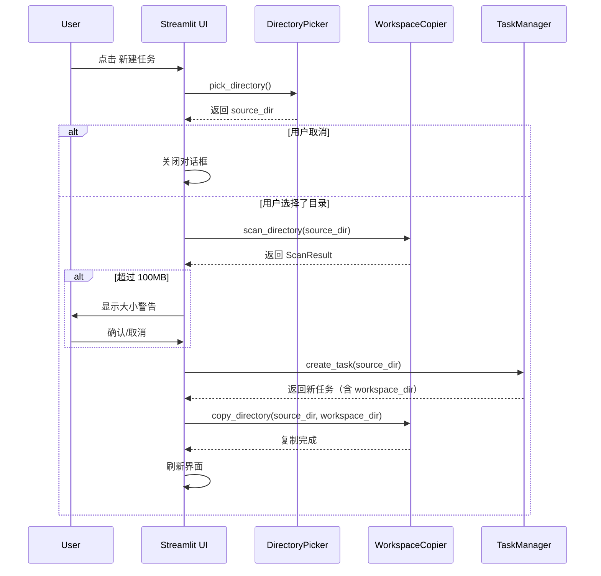

# 任务管理系统设计文档

## 概述

将现有的单任务模式扩展为多任务管理系统，用户可以创建多个任务，每个任务有独立的配置和对话历史。

**v2.0 更新**: 新增目录选择器和工作空间隔离功能，通过复制源目录到项目内部来保护用户数据安全。

## 设计决策

| 问题 | 决策 |
|------|------|
| 任务切换方式 | 侧边栏列表 + 点击切换 |
| 任务独立配置 | workspace_dir, html_file, 自定义提示词 |
| 数据持久化 | 保存到 JSON 文件 |
| 对话历史 | 跨会话保存 |
| 任务命名 | 自动生成 + 可修改 |
| **目录选择** | tkinter 原生目录选择框 |
| **数据隔离** | 复制源目录到 tasks/{id}/workspace/ |
| **忽略规则** | 使用项目 .gitignore 规则 |
| **大目录警告** | 超过 100MB 显示警告 |

## 数据模型



## 文件结构

```
auto_presentation/
├── app.py                 # UI (重构)
├── agent_core.py          # Agent核心 (基本不变)
├── task_manager.py        # 任务管理模块
├── directory_picker.py    # 🆕 目录选择器 (tkinter)
├── workspace_copier.py    # 🆕 工作空间复制器
├── system_prompt.txt      # 默认系统提示词
├── .gitignore             # 复制时的忽略规则
├── tasks/                 # 任务存储目录
│   ├── tasks.json         # 任务索引文件
│   └── task_abc123/       # 🆕 每个任务独立目录
│       └── workspace/     # 🆕 复制的工作目录
└── ...
```

## UI 布局

```
┌─────────────────────────────────────────────────────────────────┐
│                         AI Presentation Agent                    │
├──────────────────┬──────────────────────────────────────────────┤
│  🔑 API 配置     │                                              │
│  ├ API Key       │         💬 对话面板    │    🖼️ 预览面板      │
│  ├ Base URL      │                        │                     │
│  └ Model         │                        │                     │
│                  │                        │                     │
│  📋 任务列表     │                        │                     │
│  ├ + 新建任务    │                        │                     │
│  ├ ✓ 任务1      │                        │                     │
│  ├   任务2      │                        │                     │
│  └   任务3      │                        │                     │
│                  │                        │                     │
│  ⚙️ 当前任务设置 │                        │                     │
│  ├ 任务名称      │                        │                     │
│  ├ 工作目录      │                        │                     │
│  ├ HTML文件      │                        │                     │
│  └ 自定义提示词  │                        │                     │
│                  │                        │                     │
│  🎬 操作         │                        │                     │
│  ├ 刷新预览      │                        │                     │
│  ├ 清空对话      │                        │                     │
│  └ 删除任务      │                        │                     │
└──────────────────┴──────────────────────────────────────────────┘
```

## Session State 设计

### 全局状态（所有任务共享）
```python
st.session_state.api_key          # API 密钥
st.session_state.base_url         # API 基础 URL
st.session_state.model            # 当前模型
st.session_state.available_models # 可用模型列表
st.session_state.models_fetched   # 是否已获取模型
```

### 任务管理状态
```python
st.session_state.task_manager     # TaskManager 实例
st.session_state.agents           # Dict[task_id, Agent] - 每个任务的 Agent
st.session_state.is_processing    # 是否正在处理
st.session_state.preview_key      # 预览刷新 key
```

## 关键流程

### 应用启动流程


### 创建任务流程


### 发送消息流程


## Task 数据结构

```json
{
  "active_task_id": "task_abc123",
  "tasks": {
    "task_abc123": {
      "id": "task_abc123",
      "name": "销售报告",
      "workspace_dir": "D:/projects/sales",
      "html_file": "index.html",
      "custom_prompt": "",
      "chat_history": [
        {
          "type": "user_message",
          "content": "创建一个销售报告演示",
          "timestamp": "2024-01-15T10:30:00Z"
        },
        {
          "type": "assistant_message",
          "content": "好的，我来帮您创建...",
          "timestamp": "2024-01-15T10:30:05Z"
        }
      ],
      "selected_slide": 0,
      "created_at": "2024-01-15T10:00:00Z",
      "updated_at": "2024-01-15T10:30:05Z"
    }
  }
}
```

## 实施任务列表

### Phase 1: 基础任务管理 ✅
1. [x] 创建 task_manager.py 模块（Task 数据类 + TaskManager 类）
2. [x] 实现任务的 JSON 持久化（save/load）
3. [x] 重构 app.py 的 session_state 初始化
4. [x] 重构侧边栏 - 添加任务列表区域
5. [x] 实现新建任务功能
6. [x] 实现任务切换功能
7. [x] 实现删除任务功能
8. [x] 重构当前任务设置区域
9. [x] 适配 Agent 创建逻辑（每个任务独立 Agent）
10. [x] 适配对话历史显示（从当前任务读取）
11. [x] 实现自定义提示词功能

### Phase 2: 目录选择与数据隔离 ✅
1. [x] 创建 directory_picker.py - tkinter 目录选择对话框
2. [x] 创建 workspace_copier.py - 目录复制逻辑
    - [x] 解析 .gitignore 规则
    - [x] 应用忽略规则过滤文件
    - [x] 计算目录大小并支持阈值警告
    - [x] 复制文件到目标目录
3. [x] 修改 task_manager.py - 扩展 Task 数据模型
    - [x] 添加 source_dir 字段
    - [x] 添加 last_sync_at 字段
    - [x] 修改 workspace_dir 生成逻辑
4. [x] 修改 app.py - 更新 UI 交互
    - [x] 新建任务时调用目录选择框
    - [x] 显示复制进度/大小警告
    - [x] 添加重新同步按钮

## 新建任务流程

